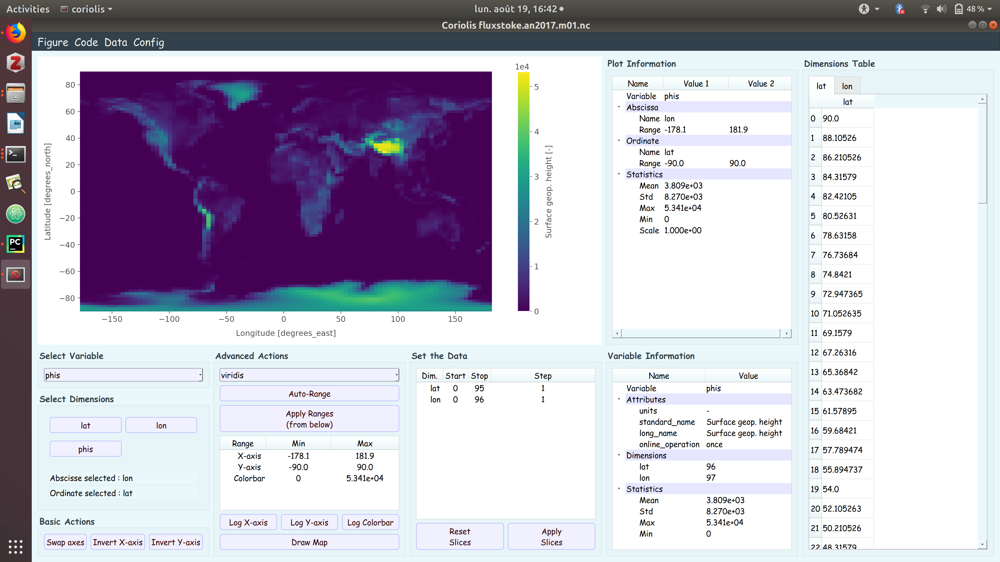

# Coriolis

## What is it ?
`coriolis` is a quick visualization python software developped using PyQt5 and xarray. 
It allows the user to get a quick insight of a NetCDF (.nc) file.

It provides multi-dimensional field main statistics, an embedded matplotlib canvas 
to visualize the data (1-D and 2-D plots) and some features to save
the figure, scale the data, change the colorbar, use non-linear axis scales and others

An animation widget is also implemented. However, at this point, matplotlib is not fast enough to enable a 
confortable and quick visualization refreshment. Other software such as NcView should be used instead.

More importantly, `coriolis` allows the user to precisely select the data to plot, namely the needed slices
can be easily given.




## How to install it ?

You need to install the dependencies before installing the package. They were
not included within the package due to some issues with pip-installed PyQt5
package.
We recommend therefore the Anaconda distribution for installing those dependencies.

In a pre-activated python3 environment, you can simply do :

``` 
$ conda install matplotlib xarray netcdf4 cartopy`
$ pip install coriolis
```


## How to use it ?

As for now, only NetCDF (.nc) files can be processed.

You can use the software by running the command :

`$ coriolis yourfile.nc`

## How to customize it ?

If you want to customize the figures style, 
you can modify the custom.mplstyle file which is in the package.
